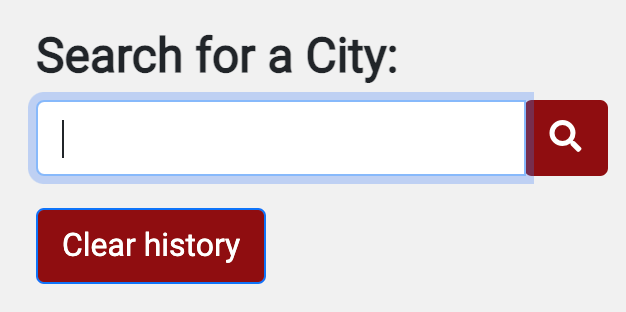

# 🌥[Weather Dashboard 🔗](https://izaack89.github.io/weather-dashboard/)

This Quiz is to help you to understand Javascript so take the quiz and you can find on what topics you should review or you can demostrate that you are a Master.

## 🌦 Weather Dashboard App

With this app you can know the weather of a City with 5 day forecast. This will help you to planify your activities according to the weather prediction.

1. Main View

2.  Weather Dashboard Functions.- This Weather Dashboard was built byt using Server-Side API (Open Weather) in order to get the information

    

3.  Local Storage.- This app use localStorage in order to save the cities that you have already looked and if you one to check again you only need to click on the button 

4.  UV Indicator.- By consulting the WHO page, I was able to identify the range of UV and their clasification. With this you can know if is safe to go outside or better stay in home

    
    

5.  Search Box.- The search box will help you to trigger the code to find the current weather, the 5-day forecast, the localStorage 

## 🌤 [Weather Dashboard GitHub Code](https://github.com/izaack89/code-base)

## ⛈ [Weather Dashboard GitHub Live Page](https://izaack89.github.io/weather-dashboard/)

## 🌩 Weather Dashboard References

- [fontawesome](https://fontawesome.com/icons?d=gallery&p=2) - Fontawesome
- [UV Index](<https://www.who.int/news-room/q-a-detail/radiation-the-ultraviolet-(uv)-index>) - UV Index - WHO
- [navbar](https://getbootstrap.com/docs/5.0/components/navbar/) - Navbar CSS
- [buttons CSS](https://getbootstrap.com/docs/5.0/components/buttons/) - Buttons CSS
- [Format MomentJs](https://momentjs.com/docs/#/displaying/format/) - time Format
- [Current Weather](https://openweathermap.org/current) - Current Weather API Document
- [Forecast Weather ](https://openweathermap.org/api/one-call-api) - Forecast Weather API Document
- [UV Index](https://openweathermap.org/api/uvi) - UV Index API DOcument

## ⛄️ Author

- **German Ramirez** - [GitHub](https://github.com/izaack89/)
